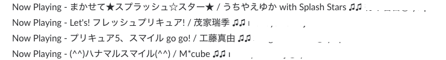
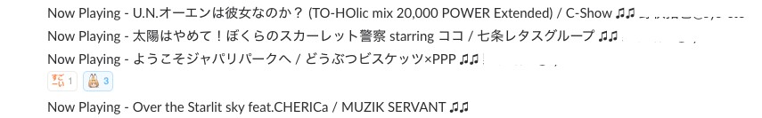
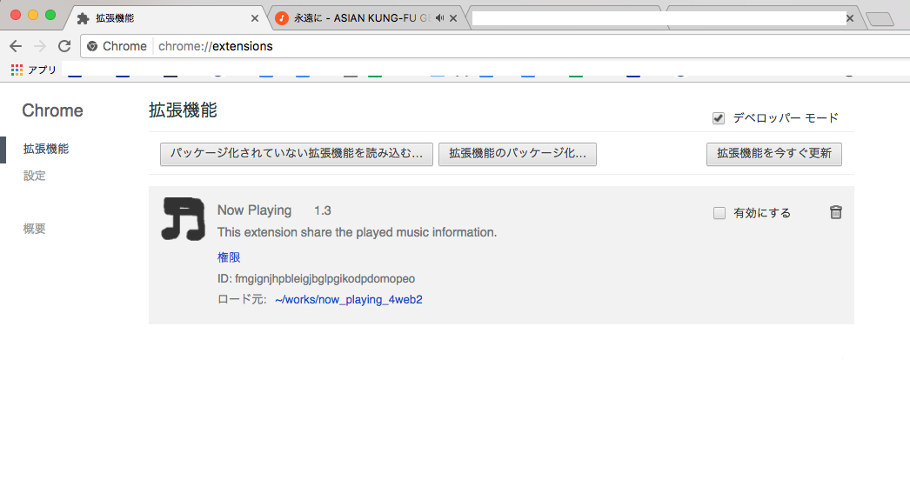
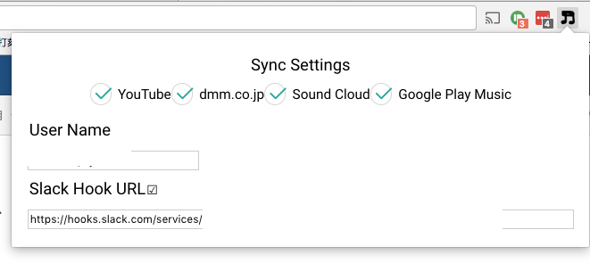

# Now Playing for Web
 \
 \
社内のSlackの\#now-playingチャンネルに音楽等の再生情報を投稿するGoogle Chrome拡張です。投稿先はincomming WebhooksのWebhook URLを取得する際に指定することができます。Web Hook URLの取得方法についてはここでは説明しません。

YouTube, SoundCloud, Google Play Music, dmm.co.jp(動画)に対応しています。荒削りなのでプルリク歓迎。

## 使い方
Releasesから最新版のcrxファイルをダウンロードします。
 \
Chromeの設定画面から拡張機能を選び、この画面に先程のファイルをD&Dし、インストールします。

 \
次に再生しているユーザ名を入力し、SlackのWebhook URLを指定します。SyncSettingsでは再生情報を公開したいサービス名を選択します。

あとは再生するだけです。

一応iTunes向けのScriptもあります \
MacのiTunes用 \
https://gist.github.com/nokkii/d6a9e5db0421752e5dbda11951fed2cd \
WindowsのiTunes用 \
https://gist.github.com/nokkii/3f91474c0277b1d7422663d5cab4d638

以下の記事を参考にしました♫ \
https://liginc.co.jp/web/tool/browser/163575